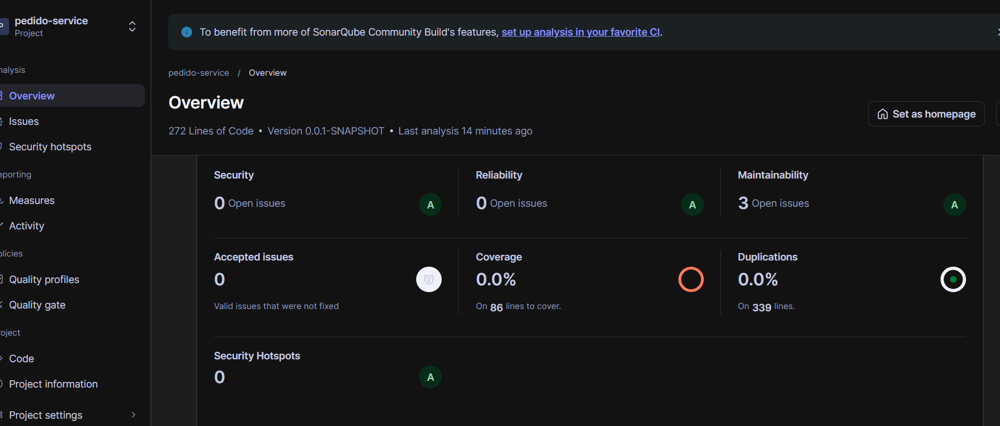
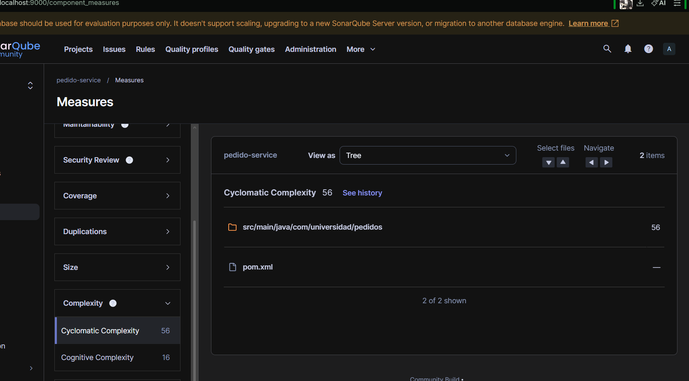
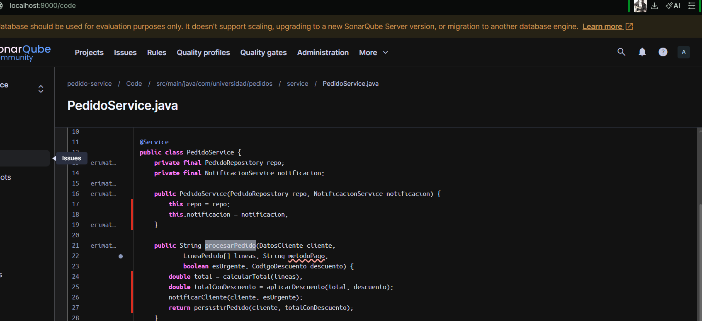

# Refactorizacion U11 Post 1

## Analisis inicial (SonarQube)
| Metrica | Valor |
|---------|-------|
| CC de procesarPedido | 56 |
| Code Smells reportados | 3 |
| TDR inicial | 0 min |

## Tecnicas aplicadas
- Extract Method
- Extract Class
- Value Objects (DatosCliente, Direccion, LineaPedido, CodigoDescuento)

## Resumen de cambios
- `PedidoService` reducido a metodos de orquestacion.
- `NotificacionService` extraido para separar responsabilidades.
- Data clumps reemplazados por value objects inmutables.

## Analisis final (SonarQube)
| Metrica | Valor |
|---------|-------|
| CC de procesarPedido | 1 |
| Code Smells reportados | 0 |
| TDR final | 0 min |

## Capturas

## Ejecucion del analisis
1. Levantar SonarQube en Docker.
2. Ejecutar `mvn verify`.
3. Ejecutar `mvn sonar:sonar -Dsonar.host.url=http://localhost:9000 -Dsonar.token=TU_TOKEN`.
